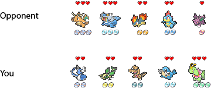
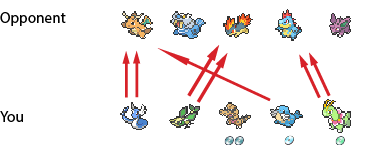
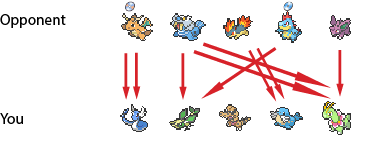
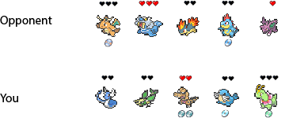

Rules
====

**Goal:** have a better hand than your opponent *and* correctly guess what your final hand will be after battling the opponent.

## Gameplay

At the beginning of each round, both players put 1 coin in a collective pot as ante. Each player draws a hand of 5 cards, and each can see all of their 5 cands but only 3 of the opponent's.

Each player must then make a bet on what rank their final hand will be at the end of the round. If the cost of a bet is *x*, you put *x* coins into the pot. After making a bet, both players have the option to swap any of their cards for another card in the deck.

After both players have made their bets and any swaps, their hands will be revealed, and the Pokémon in each hand battle to reduce the rank of the opponent's hand. 

Whoever's remaining hand has a higher rank wins, and they collect the pot sum. If their hand is at least as high as what they bet it would be, they will receive an __additional__ payout, equal to the pot sum multiplied by the payout factor corresponding to their bet.

Hand rankings, costs, and payout factor are [located here](docs/hand_rankings.md).

[Types and levels](docs/deck.md) in Pokémon deck.

## Hand Combat

Your hand consists of 5 Pokémon, which each correspond to a type and a level. In battle, each Pokémon has a health stat and an attack counter, both of which are set equal to the level of that Pokémon. For example, if one of your cards is a Raichu, an electric-type and Lv.3 card, then it will start with an HP of 3 and it will be able to attack up to 3 times.

A Pokémon in your hand may attack a Pokémon in the opponent's hand only if the type of your Pokémon is super effective against the opponent's. This attack reduces the attack counter by 1. 

Keep in mind that as the player, your job is __not__ to control how the Pokémon in your hand attack your opponent's hand. Your job is to set up your hand as best you can to prevail against the opponent. During the combat phase, the Pokémon in your hand will attack the opponent's in a way that minimizes their final hand rank (i.e., they will employ the best possible strategy).

### Example

Note:  --> health point.  --> attacks remaining.

Suppose you and your opponent have bet and swapped out cards, and your hands are revealed as follows:

Your Pokémon then attack the opponent optimally as follows:

The opponent's Pokémon then attack your Pokémon optimally as follows:

The table now looks like this:

So your opponent's final hand is their Walrein and Nidoran♂. Yours is your Krookodile. Both your hands have been reduced to the lowest rank, High level. The opponent's level sum is 4 (3 from Walrein, 1 from Nidoran♂), while yours is 2 (from Krookodile). So they win.

