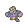
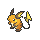
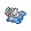

Deck
======

The deck has 54 cards, each represented by a Pokémon of a given type and level.

| Type | Lv.3 | Lv.2 | Lv.1 |
| --- | --- | --- | --- |
| **Normal** |  |  |  |
| **Fire** |  |  |  |
| **Fighting** |  |  |  |
| **Water** |  |  |  |
| **Flying** |  |  |  |
| **Grass** |  |  |  |
| **Poison** |  |  |  |
| **Electric** |  |  |  |
| **Ground** |  |  |  |
| **Psychic** |  |  |  |
| **Rock** |  |  |  |
| **Ice** |  |  |  |
| **Bug** |  |  |  |
| **Dragon** |  |  |  |
| **Ghost** |  |  |  |
| **Dark** |  |  |  |
| **Steel** |  |  |  |
| **Fairy** |  |  |  |