Formulas
==================

There are `54 choose 5` = 3,162,510 ways to draw a hand from this deck.

## Joint Hand Probabilities
The row hands pertain to matches among types of Pokémon. The column hands pertain to matches among levels of Pokémon.

| Name	| Flush	| Quadruple	| Full house	| Triple	| Two pair 	| 
| ---	| ---	| ---	| ---	| ---	| ---	|
| **Full house**	| 0| 0| 0| 0| 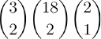|
| **Flush**	| 0 | 0 | 0 | 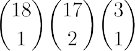 | 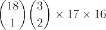 |
| **Two pair** | 0 | 0 | 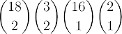 |  | 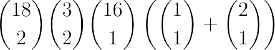 |
| **Pair** 	| 0 | 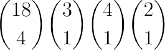 | 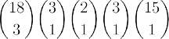 | 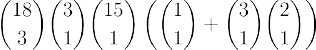 | 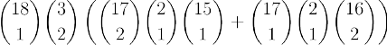 |
| **No pairs** | 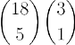 | 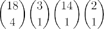 | 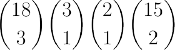 | 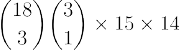 | 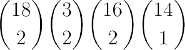 |