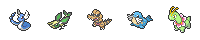

Hand Rankings
===========

Hand rankings are usually based on the levels in your hand, but having sets of Pokémon of the same type can sometimes trump other hands. The following hands are ranked from best to worst.

| Hand		| Description	| Example	| Cost | Payout factor |
| ----  	| -----------	| -------	| --- | --- |
| Full house (types) | 3 mons of same type, 2 mons of same type | | 9 | 128 |
| Flush (level)	| 5 mons of same level 	| 	| 8 | 64 |
| Flush (types)	| 3 mons of same type 	| 	| 7 | 32
| Two pair (types) 	| 2 mons of same type, 2 mons of same type 	| 	| 6 | 16 |
| Quadruple (level) 	| 	4 mons of same level 	| 	| 5 | 8 |
| Full house (level) 	| 3 mons of same level, 2 mons of same level | 	| 4 | 4 |
| Two pair (level) 	| 2 mons of same level, 2 mons of same level | 	| 3 | 2 |
| Triple (level) 	| 3 mons of same level 	| 	| 2 | 1 |
| Pair (level) 	| 2 mons of same level 	| 	| 1 | 1/2 |
| High level 	| otherwise, highest level sum |  n/a	| 0	| 0 | 

See [derived probability](hand_probabilities.md) for more info.