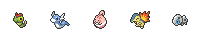

Hand Rankings
===========

The following hand rankings are listed from best to worst.

| Hand		| Description	| Example	|
| ----  	| -----------	| -------	|
| Full house - Types | 3 mons of the same type, 2 mons of a different type | |
| Fully evolved	| 5 fully evolved mons	| 	|
| Level flush	| 5 mons of the same level 	| 	|
| Type flush 	| 3 mons of the same type 	| 	|
| Two pair - Types 	| 2 mons of the same type, 2 mons of a different type 	| 	|
| Quadruple - Level 	| 	4 mons of the same level 	| 	|
| Full house - Level 	| 3 mons of the same level, 2 mons of a different level | 	|
| Triple - Level 	| 3 mons of the same level 	| 	|
| Pair - Type 	| 2 mons of the same type 	| 	|
| Two pair - Level 	| 2 mons of the same level, 2 mons of a different level | 	|
| Pair - Level 	| 2 mons of the same level 	| 	|
| High level 	| otherwise, goes to highest level remaining 	| 	|